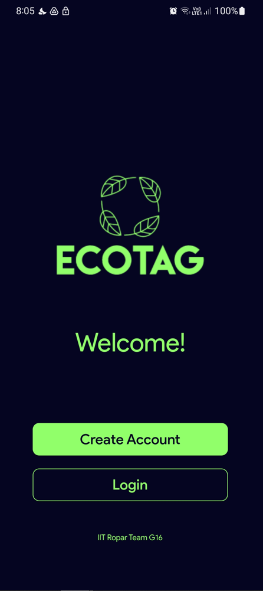
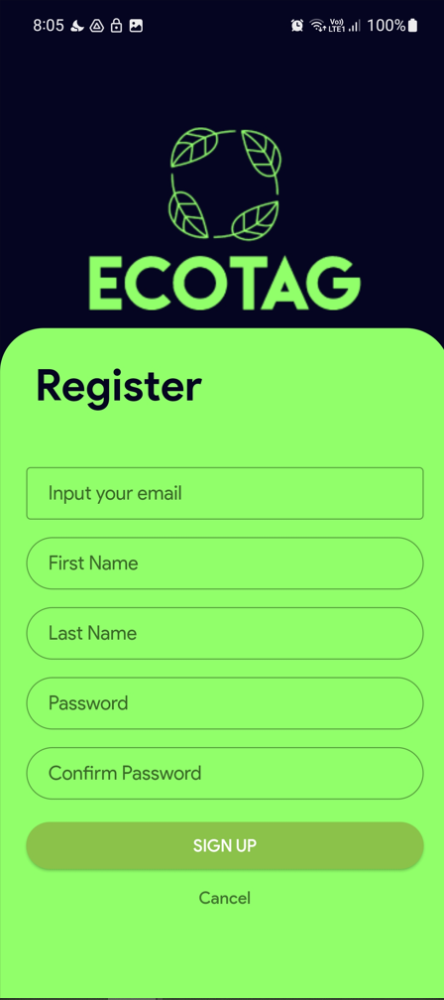
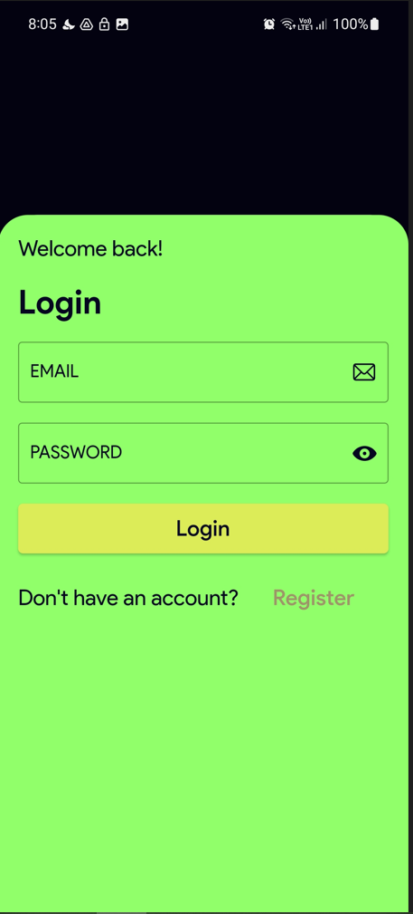
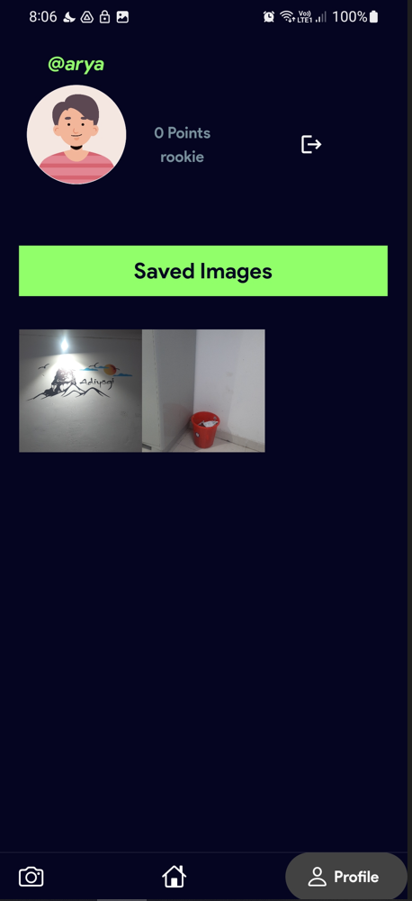
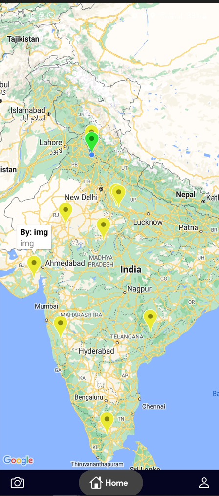
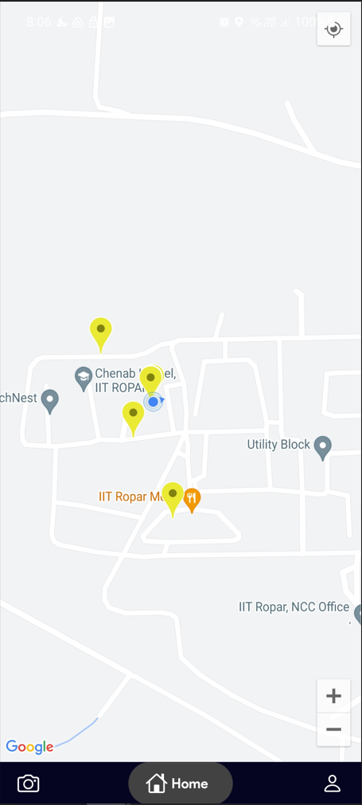

# EcoTags

A new Flutter application that helps users track and reduce their carbon footprint!

## App 

<table>
  <tr>
    <td align="center">
      
    </td>
    <td align="center">
      
    </td>
    <td align="center">
      
    </td>
  </tr>
  <tr>
    <td align="center">
      Home Page
    </td>
    <td align="center">
      Register Page
    </td>
    <td align="center">
      Login Page
    </td>
  </tr>
</table>
<table>
  <tr>
    <td align="center">
      
    </td>
    <td align="center">
      
    </td>
    <td align="center">
      
    </td>
  </tr>
  <tr>
    <td align="center">
      Profile Page
    </td>
    <td align="center">
      Map Page
    </td>
    <td align="center">
      Zoom Tags
    </td>
  </tr>
</table>


## Getting Started

This project is a starting point for a Flutter application. Follow these steps to get started:


### Get the Flutter SDK

1. Download and install the latest release of the Flutter SDK from the official [Flutter website](https://flutter.dev/docs/get-started/install).

2. Extract the zip file and place the contained `flutter` folder in the desired installation location.


### Update your path

1. Go to Edit environment variables for your account.

2. Edit environment variables. In the user variables under the entry called Path, append the full path to `flutter\bin`.

3. Run the command `flutter doctor` to see if there are any platform dependencies you need to complete the setup.


### Install Android Studio

1. Download and install Android Studio from the official [Android Studio website](https://developer.android.com/studio).

2. Run `flutter doctor` to confirm that Flutter has located your installation of Android Studio. If Flutter cannot locate it, run `flutter config --android-studio-dir=<directory>` to set the directory that Android Studio is installed to.


### Set up your Android Device

1. Enable Developer options and USB debugging on your device.

2. Plug your Android device into your computer using a USB cable. If prompted on your device, authorize your computer to access your device.

3. In your terminal, run the `flutter devices` command to verify that Flutter recognizes your connected Android device.


### Agree to Android Licenses

1. Make sure that you have a version of Java 11 installed and that your `JAVA_HOME` environment variable is set to the JDK's folder.

2. Agree to the licenses of the Android SDK platform using the command `flutter doctor --android-licenses`.


### Run the Flutter App

1. Extract the folder and open it in Visual Studio Code. 

2. Open terminal & navigate to softygcollect-main folder which has all subfolders and flutter plugins.

2. To run app on android first do all mentioned things to setup your android device.

3. Once you can see your device then connect to it.

4. Run following command to install dependencies & do check terminal is open in main folder:
```
flutter pub get
```

5. Once all dependencies are installed run & app will open in your phone:
```
flutter run
```

6. Another option is to install the `ecotags.apk` file on your android phone.

### LCOV Code Coverage

1. You will need to install lcov in linux using:
```
sudo apt install lcov
```

2. To generate report use the following command and report is generated in a new coverage folder:
```
flutter test --coverage && lcov --remove coverage/lcov.info 'lib/generated/*' 'lib/main.dart' 'lib/constants.dart' -o coverage/lcov.info && genhtml coverage/lcov.info -o coverage/html
```


That's it! You should now be able to run your Flutter app! 


